# MY_CHATBOT_APP

## Overview

MY_CHATBOT_APP is a simple multi-client chat application written in C, enabling real-time communication between clients through a central server. It demonstrates fundamental concepts of network programming using TCP sockets and select-based multiplexing, providing features like client registration, broadcasting, and direct messaging.

## Features

- Multi-client support with a limit of 32 clients
- Client registration by username
- Broadcast messages to all connected clients
- Direct messaging (DM) between registered clients
- Command to list all connected clients
- Graceful handling of client disconnections and server shutdown
- Color-coded console output for easy monitoring

## Project Structure

| File                      | Description                                          |
|---------------------------|------------------------------------------------------|
| `SERVER/server_main.c`    | Main server program handling connections and events |
| `SERVER/server_helper.c`  | Helper functions for client management and messaging |
| `SERVER/server_helper.h`  | Header file for server helper functions              |
| `SERVER/server.h`         | Server constants, data structures, and includes      |
| `CLIENT/client_main.c`    | Main client program for connecting and interacting   |
| `CLIENT/client_helper.c`  | Client-side helper functions                          |
| `CLIENT/client_helper.h`  | Header for client helper functions                    |
| `CLIENT/client.h`         | Client constants, includes, and color codes           |

## Prerequisites

- POSIX-compliant OS (Linux, macOS)
- GCC or compatible C compiler
- Basic networking setup allowing TCP connections on chosen port

## Build and Complile

### Server

cd SERVER

$ make -B -f MakeFile
gcc -Wall -Wextra -g -c server_main.c -o server_main.o
gcc -Wall -Wextra -g -c server_helper.c -o server_helper.o
gcc -Wall -Wextra -g server_main.o server_helper.o -o server

$ ./server

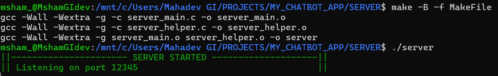

cd CLIENT

$ make -B -f MakeFile
gcc -Wall   -c -o client_main.o client_main.c
gcc -Wall   -c -o client_helper.o client_helper.c
gcc -Wall client_main.o client_helper.o -o client

$ ./client <IP Address> port no.

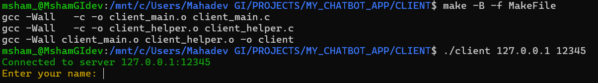

## CLIENT REGISTRATION TO SERVER 

In the Client side terminal 

It will prompt to write name of user to be regsitered with Server

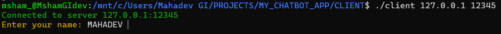

Once name is registered in the SERVER database it stores the client information using socket fd

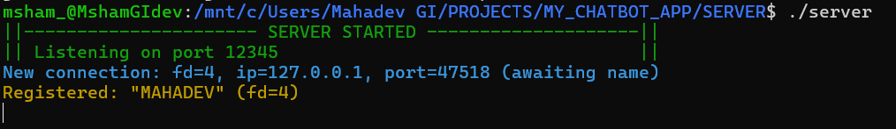

Once registered with server the respective Client is prompted with options to select

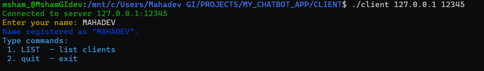

## CLIENT OPTIONS (LIST CLIENT , CHAT WITH OTHER CLIENT, BROADCAST MESSAGE TO ALL CONNECTED CLIENTS from one client)

- > LIST CLIENTS

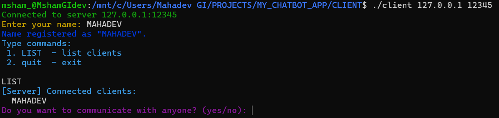

In this pic only one client is connected. 

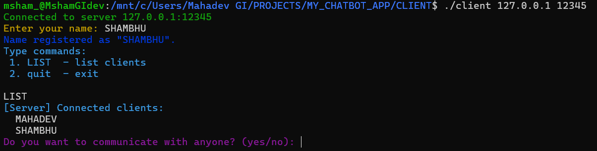

In this pic the second client is registere to server and able to LIST clients

SERVER SIDE OUTPUT 

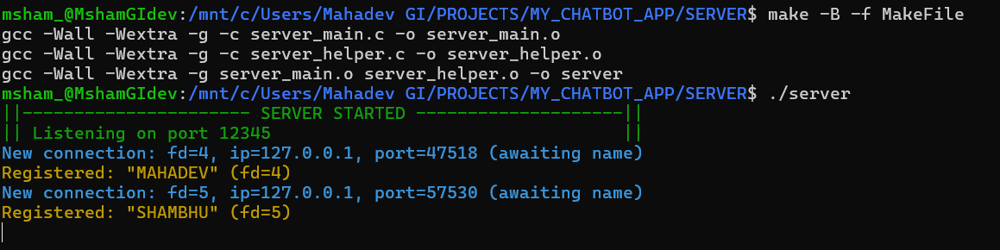

- > CHAT WITH OTHER CLIENT

After listing the client the connected client is able to communitcate with other connected clients 
by typing - yes

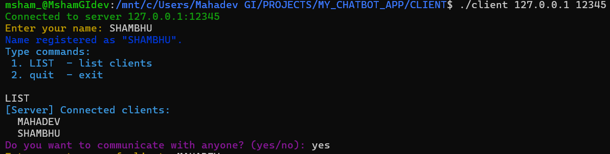

Then it will ask the respected client to type the name of the client it wants to chat with

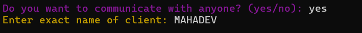

Then the respective client will type the message 

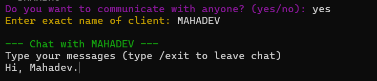

this message once entered from SHAMBHU (CLIENT 2) it will be recived on other end 

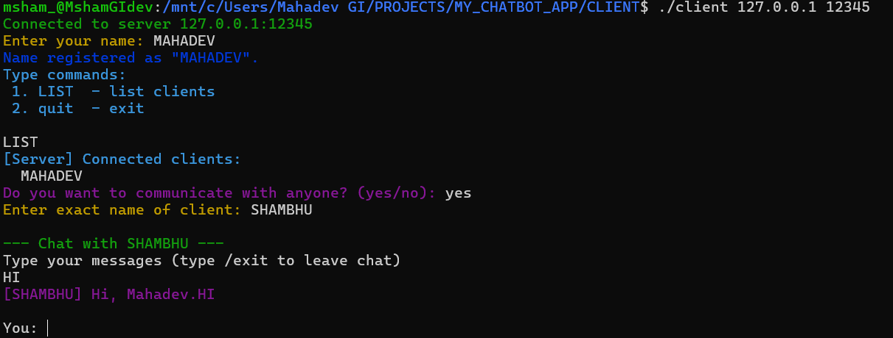

then MAHADEV (CLIENT 1) will send the message to CLIENT 2 which will be recived on it's end

CLIENT 1

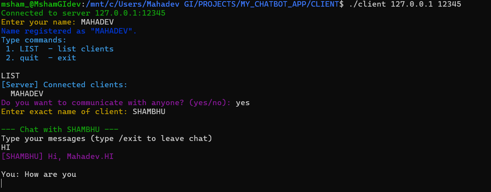

CLIENT 2

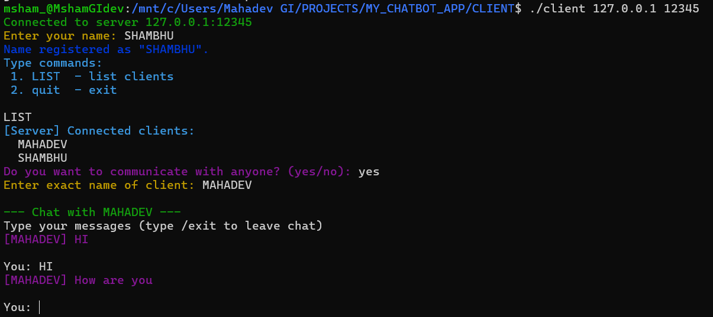

- > BROADCAST MESSAGE TO ALL CONNECTED CLIENTS from one client

This can be done once we connect multiple clients and one of the connected client wishes to send messages to all other client.

In the Client terminal from where we want to BROADCAST message to all other clients just simply give this prompt 

BROADCAST <message>

example

-> Three connected client we have 

MAHADEV
SHAMBHI
GI 

From MAHADEV we send the message to all other clients connected to server

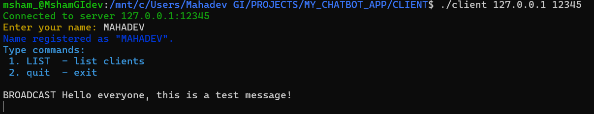

Message recived on other client side

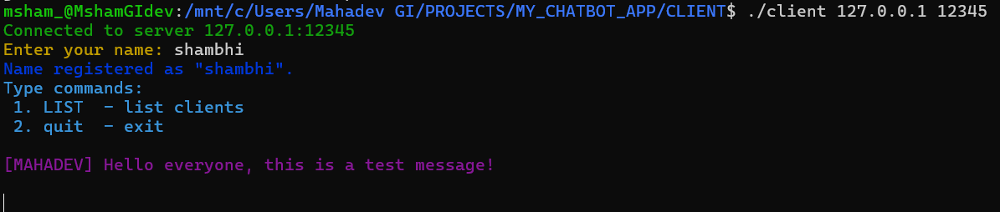 - > SHAMBHI

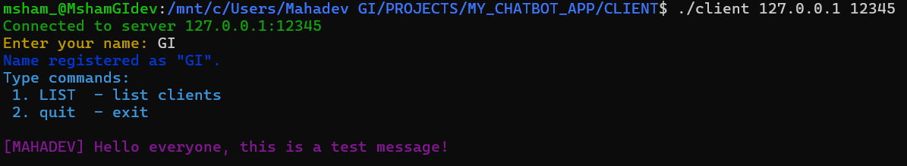 - > GI

